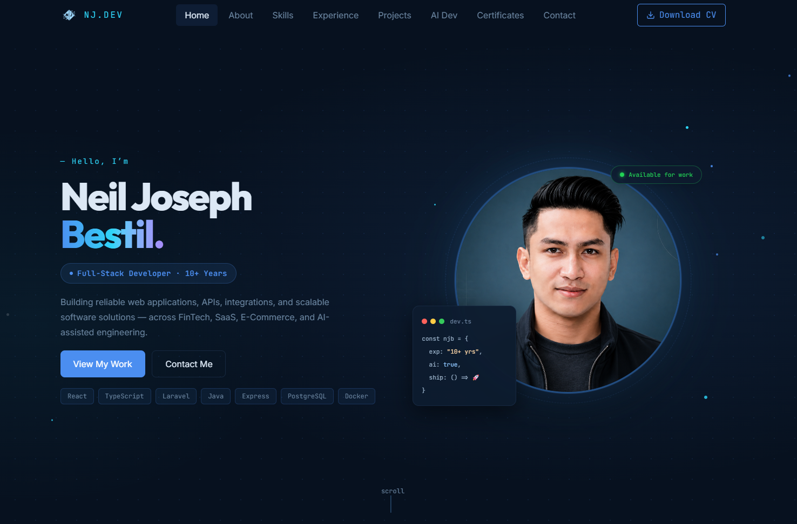

# NJ Portfolio — Neil Joseph Bestil

My personal portfolio showcasing my work as a Full-Stack Developer, including professional experience, selected projects, technical skills, certifications, and my approach to AI-assisted development. Built with React, TypeScript, and Tailwind CSS.

**[Visit my portfolio](https://njbestil.github.io/nj-portfolio/)**



## Features

- Eight sections: Home, About, Skills, Experience, Projects, AI Dev, Certificates, and Contact.
- Project showcase with detailed case-study dialogs.
- Certificate cards with a PDF viewer and a CV download link.
- Section navigation with active-section tracking and scroll controls.
- Entrance animations powered by Animate.css.
- Contact form with Formspree integration, plus direct email and social links.

## Tech stack

| Area | Tools |
| --- | --- |
| Interface | React 19, TypeScript |
| Build tooling | Vite 8 |
| Styling | Tailwind CSS 4 |
| Icons and animation | React Icons, Animate.css |
| Code checks | ESLint, TypeScript |
| Hosting and deployment | GitHub Pages, GitHub Actions |

This repository contains the portfolio frontend. Technologies described in my skills and project case studies represent my broader experience, rather than additional services required to run this website.

## Run locally

Install Node.js and npm using an LTS release compatible with the project's Vite version. The deployment workflow uses Node.js `lts/*`.

```sh
git clone https://github.com/njbestil/nj-portfolio.git
cd nj-portfolio
npm ci
npm run dev
```

Open the URL printed by Vite, using the `/nj-portfolio/` base path. The portfolio can run without contact-form configuration; sending messages requires the setup below.

## Available scripts

| Command | Purpose |
| --- | --- |
| `npm run dev` | Start the development server. |
| `npm run build` | Run TypeScript compilation checks and generate `dist/`. |
| `npm run preview` | Serve the production build locally after building. |
| `npm run lint` | Run ESLint. |
| `npm run format` | Format files with Prettier; see the note below. |
| `npm run format:check` | Check formatting with Prettier; see the note below. |

The formatting scripts exist, but Prettier is not currently declared as a project dependency. They are not guaranteed to work after a clean installation. No automated test script is configured.

## Project structure

```text
src/
├── app/             # Page composition and providers
├── components/      # Shared layout and UI components
├── sections/        # Portfolio sections and their dedicated components
├── data/            # Profile, skills, experience, projects, and certificates
├── hooks/           # Navigation, scrolling, and entrance animations
├── lib/             # Shared helpers and constants
├── types/           # Portfolio data types
├── assets/          # Images and source assets
└── styles/          # Global styles
public/              # CV, certificate PDFs, and public assets
docs/                # README preview image
.github/workflows/   # GitHub Pages deployment
```

## Update portfolio content

| Content | Where to edit |
| --- | --- |
| Name, introduction, email, and social links | [src/data/profile.ts](src/data/profile.ts) |
| Technical skills | [src/data/skills.ts](src/data/skills.ts) |
| Work experience | [src/data/experience.ts](src/data/experience.ts) |
| Projects and case studies | [src/data/projects.ts](src/data/projects.ts) |
| AI development workflow | [src/data/ai-dev.ts](src/data/ai-dev.ts) |
| Certificate metadata | [src/data/certificates.ts](src/data/certificates.ts) |
| Section layouts and additional copy | [src/sections](src/sections) |
| Portrait and project images | [src/assets/images](src/assets/images) |
| CV document | [public/Bestil_CV.pdf](public/Bestil_CV.pdf) |
| Certificate documents | [public/certs](public/certs) |
| Section composition and order | [src/app/App.tsx](src/app/App.tsx) |

When replacing a document or image, keep its filename or update the corresponding reference. Check filename capitalization and verify links under the deployed `/nj-portfolio/` path.

## Contact form configuration

The contact form reads `VITE_FORMSPREE_ENDPOINT` in [Contact.tsx](src/sections/Contact.tsx).

For local development, create a `.env.local` file in the project root with your Formspree form endpoint:

```dotenv
VITE_FORMSPREE_ENDPOINT=https://formspree.io/f/YOUR_FORM_ID
```

Replace `YOUR_FORM_ID` with your form's identifier and restart the development server. `.env.local` is ignored by Git. Without this value, the form displays a configuration message and directs visitors to the email link.

For GitHub Pages, provide the same value during the production build. For example, create a GitHub Actions repository variable named `VITE_FORMSPREE_ENDPOINT`, then add this environment mapping to the existing **Build** step in [.github/workflows/deploy.yml](.github/workflows/deploy.yml):

```yaml
- name: Build
  env:
    VITE_FORMSPREE_ENDPOINT: ${{ vars.VITE_FORMSPREE_ENDPOINT }}
  run: npm run build
```

This mapping is a setup instruction; it is not currently included in the workflow. Rebuild and redeploy after changing the endpoint. `VITE_` values are included in the browser build, so use the public form endpoint here, never a private API key.

## Deployment

GitHub Actions builds and deploys the portfolio when changes reach `main`. The workflow publishes `dist/` to GitHub Pages, with Vite configured to use `base: '/nj-portfolio/'`.

Current deployment checks to keep in mind:

- The CV and certificate links in the source currently use root-relative URLs such as `/Bestil_CV.pdf` and `/certs/...`. These need the repository base path when deployed under `/nj-portfolio/`.
- Contact-form submission requires the build-time endpoint configuration above.

## Author

**Neil Joseph Bestil — Full-Stack Developer**

[GitHub](https://github.com/njbestil) · [LinkedIn](https://www.linkedin.com/in/neil-joseph-bestil-b8a67822b/)
